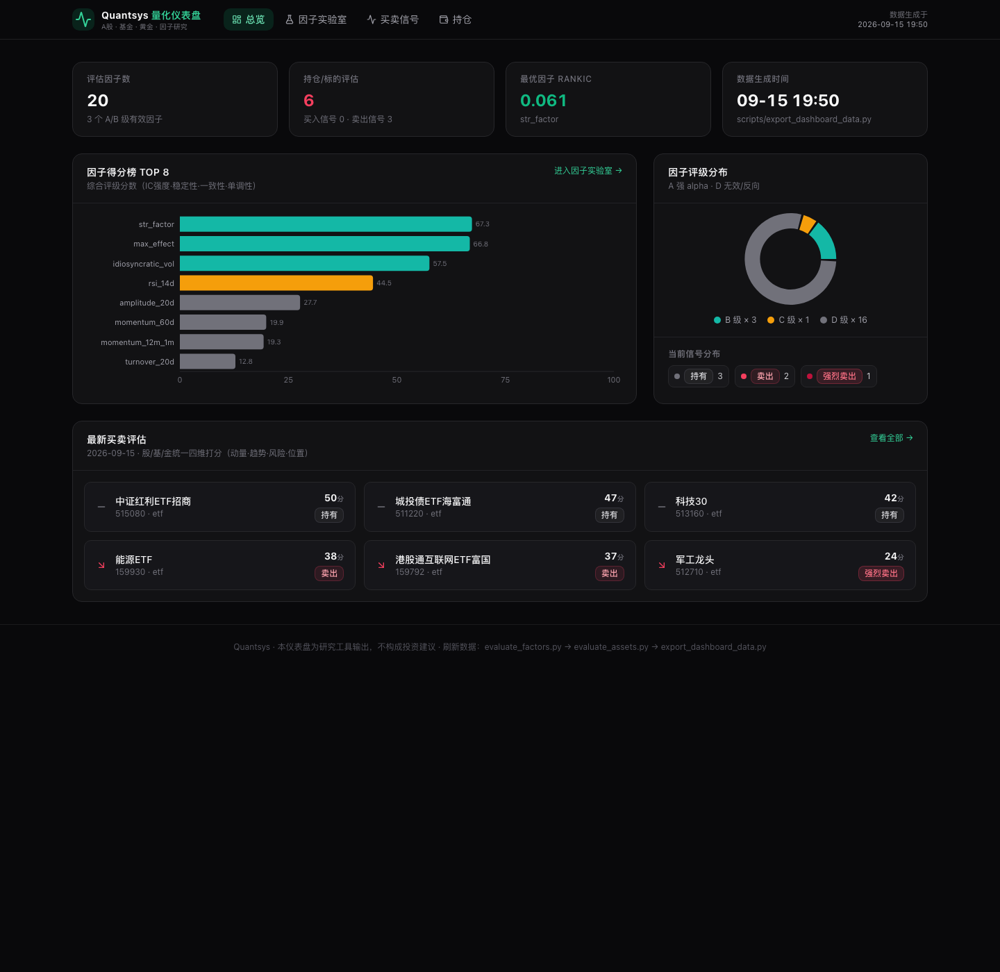
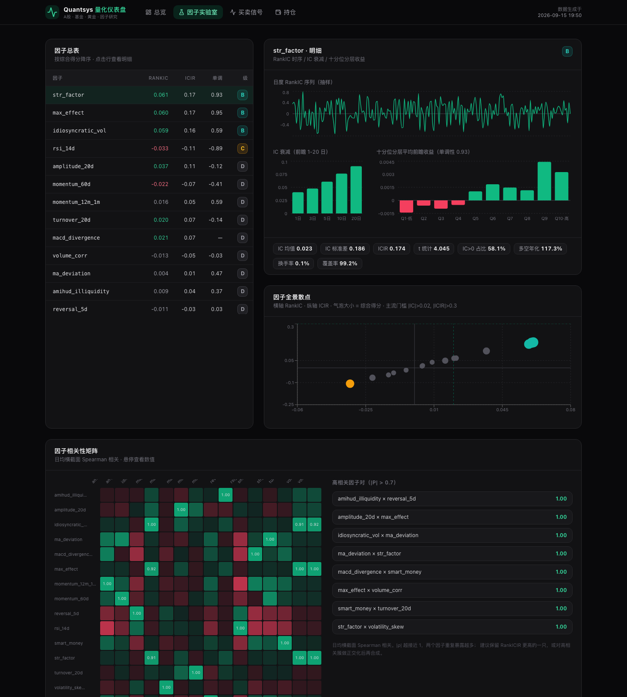
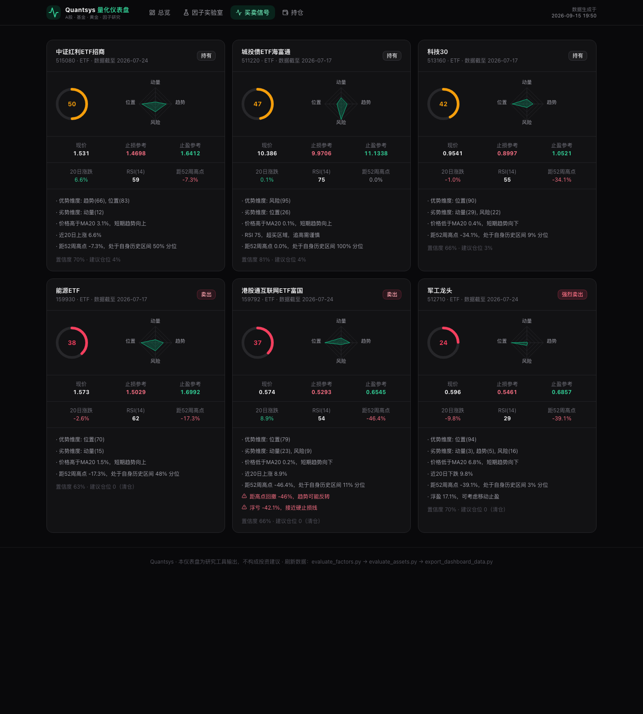
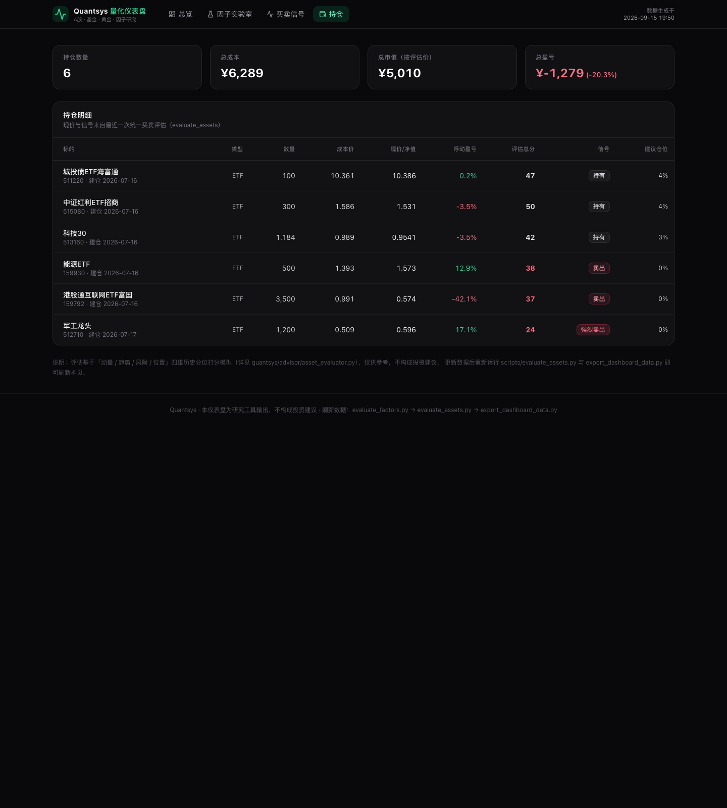

# Quantsys 量化仪表盘

Quantsys 量化交易系统的可视化仪表盘：因子有效性评估 · 股/基/金统一买卖信号 · 持仓分析。

深色主题单页应用，React 19 + TypeScript + Vite + Tailwind CSS + shadcn/ui + Recharts。

| 总览 | 因子实验室 |
|---|---|
|  |  |

| 买卖信号 | 持仓 |
|---|---|
|  |  |

## 功能

- **总览**：因子数 / 信号统计 KPI、因子得分榜 TOP8、评级分布环图、最新买卖评估速览
- **因子实验室**：20 因子总表（RankIC · ICIR · 单调性 · A-D 评级）、日度 RankIC 时序、IC 衰减（1-20 日）、十分位分层收益、IC-ICIR 全景散点（含主流门槛参考线）、相关性热力图与冗余诊断
- **买卖信号**：每个标的的评分环 + 四维雷达（动量/趋势/风险/位置）、止损止盈参考、理由与风险标记、置信度与建议仓位
- **持仓**：成本/现价/浮动盈亏/评估总分/信号/建议仓位一览

## 快速开始

```bash
npm install
npm run dev        # http://localhost:3000
```

```bash
npm run build      # 产物在 dist/（纯静态站点）
npm run preview    # 本地预览构建产物
```

## 数据从哪来

仪表盘本身不联网，数据来自构建期打包的 `src/data/dashboard.json`，
由系统脚本一键导出（已随仓库提交，clone 即可看到真实示例数据）：

```bash
# 在项目根目录（dashboard 的上级目录）依次运行：
python3 scripts/evaluate_factors.py --start 2022-01-01 --save-weights   # 因子评估
python3 scripts/evaluate_assets.py --positions                          # 买卖评估
python3 scripts/export_dashboard_data.py                                # 导出 dashboard.json
```

刷新数据后重新 `npm run dev`（或 `npm run build`）即可。

## 部署到 GitHub Pages

`vite.config.ts` 已配置 `base: './'`（相对路径），构建产物可直接托管：

```bash
npm run build
# 将 dist/ 推到 gh-pages 分支，或使用 GitHub Actions 自动部署
```

## 目录结构

```
dashboard/
├── src/
│   ├── data/dashboard.json      # 打包数据（由 export_dashboard_data.py 生成）
│   ├── sections/                # 总览 / 因子实验室 / 买卖信号 / 持仓
│   ├── components/              # 相关性热力图等自定义组件 + shadcn/ui
│   └── pages/Home.tsx           # 入口布局与导航（支持 #hash 深链接）
├── docs/screenshots/            # 预览截图
└── index.html
```

## 免责声明

本仪表盘为量化研究工具的输出展示，不构成投资建议。
